# Focus Pet

Focus Pet to aplikacja webowa wspierająca pracę w skupieniu, ograniczanie prokrastynacji i budowanie pozytywnych nawyków. Użytkownik opiekuje się wirtualnym, magicznym zwierzakiem, którego zdrowie, energia i rozwój zależą od wykonywania zadań oraz odbywania sesji Deep Work.

Projekt został przygotowany jako aplikacja React z routingiem, systemem zadań, sklepem, mechaniką nagród i kar, integracją Firebase oraz narzędziami analitycznymi Google Analytics i Hotjar.

Link do strony: https://focus-pet-app-production.up.railway.app/

## Funkcje aplikacji

- logowanie i rejestracja użytkownika,
- onboarding z wyborem zwierzaka,
- opieka nad zwierzakiem i podgląd statystyk XP, HP oraz Energy,
- lista zadań oraz projektów z podzadaniami,
- wybór jednego zadania do sesji skupienia,
- dynamiczny timer zależny od czasu ustawionego w zadaniu,
- pauza sesji,
- zakończenie lub przerwanie sesji,
- naliczanie monet, XP i HP po zakończonej sesji,
- kara HP po przerwaniu sesji,
- tryb hibernacji przy krytycznie niskim HP,
- sesja regeneracyjna dla zwierzaka,
- sklep z filtrami All / Food / Accessories,
- zakup przedmiotów za monety,
- wpływ przedmiotów na HP i energię zwierzaka,
- historia aktywności i zakończonych sesji,
- Google Analytics dla page view w aplikacji SPA,
- Hotjar/Contentsquare do analizy zachowania użytkownika.

## Technologie

- React,
- Create React App,
- React Router,
- Firebase Authentication,
- Firestore,
- React GA4,
- Hotjar/Contentsquare,
- CSS,
- Railway.

## Kluczowe pliki projektu

Poniżej opisano najważniejsze pliki związane z zakresem sklepu, sesji skupienia, gamifikacji i analityki. Nie jest to pełna struktura repozytorium, tylko lista elementów istotnych dla działania opisanych modułów.

| Plik | Rola w projekcie |
| --- | --- |
| `public/index.html` | Zawiera podstawowy dokument HTML aplikacji oraz tag Hotjar/Contentsquare w sekcji `<head>`. |
| `src/App.js` | Definiuje routing aplikacji, inicjalizuje Google Analytics i Hotjar oraz podpina listener analityczny. |
| `src/components/AnalyticsListener.jsx` | Nasłuchuje zmian ścieżki w React Router i wysyła page view do Google Analytics. |
| `src/components/PetCard.jsx` | Wyświetla zwierzaka, jego stadium oraz paski XP, HP i Energy. |
| `src/components/ShopItemCard.jsx` | Odpowiada za pojedynczą kartę produktu w sklepie. |
| `src/components/StatBar.jsx` | Renderuje pasek statystyki oraz krótką animację przyrostu punktów. |
| `src/pages/ShopPage.jsx` | Obsługuje sklep, filtrowanie produktów i zakup przedmiotów. |
| `src/pages/FocusSessionPage.jsx` | Obsługuje timer sesji, pauzę, zakończenie, przerwanie sesji, dźwięki zen i zapis nagród. |
| `src/pages/SessionPausedPage.jsx` | Wyświetla ekran pauzy sesji. |
| `src/pages/SessionCompletePage.jsx` | Wyświetla podsumowanie sesji, nagrody albo karę po przerwaniu skupienia. |
| `src/pages/TasksPage.jsx` | Pozwala wybrać zadanie do sesji i obsługuje projekty z podzadaniami. |
| `src/pages/HistoryPage.jsx` | Pokazuje historię zakończonych i przerwanych sesji. |
| `src/utils/analytics.js` | Zawiera funkcje inicjalizacji Google Analytics, Hotjar oraz wysyłania page view. |
| `src/utils/rewards.js` | Zawiera logikę naliczania monet, XP, HP oraz zadawania obrażeń zwierzakowi. |
| `src/utils/timer.js` | Zawiera pomocnicze funkcje formatowania czasu sesji. |
| `src/utils/storage.js` | Obsługuje zapis i odczyt danych użytkownika z Firestore. |


## Uruchomienie lokalne

Przejdź do katalogu aplikacji:

```bash
cd focus-pet-app
```

Zainstaluj zależności:

```bash
npm install
```

Uruchom aplikację:

```bash
npm start
```

Aplikacja lokalnie uruchamia się pod adresem:

```text
http://localhost:3000
```

## Build produkcyjny

```bash
npm run build
```

Build tworzy folder `build`, który może zostać wdrożony na Railway lub innym hostingu statycznym.

## Zmienne środowiskowe

Aplikacja korzysta ze zmiennych w formacie `REACT_APP_*`. Lokalnie należy utworzyć plik `.env` w katalogu `focus-pet-app/`.

```env
REACT_APP_FIREBASE_API_KEY=twoj-klucz
REACT_APP_FIREBASE_AUTH_DOMAIN=twoj-projekt.firebaseapp.com
REACT_APP_FIREBASE_PROJECT_ID=twoj-projekt
REACT_APP_FIREBASE_STORAGE_BUCKET=twoj-bucket
REACT_APP_FIREBASE_MESSAGING_SENDER_ID=twoje-id
REACT_APP_FIREBASE_APP_ID=twoj-app-id
REACT_APP_HOTJAR_SITE_ID=twoje-hotjar-id
REACT_APP_GA_MEASUREMENT_ID=G-XXXXXXXXXX
```

Na Railway te same wartości należy dodać w sekcji `Variables`, a po zmianie wykonać ponowny deploy.

## Google Analytics

Google Analytics zostało zintegrowane przez pakiet `react-ga4`.

Inicjalizacja znajduje się w pliku:

```text
src/utils/analytics.js
```

Ponieważ aplikacja korzysta z React Router, przejścia między podstronami nie przeładowują całej strony. Z tego powodu dodano komponent:

```text
src/components/AnalyticsListener.jsx
```

Komponent nasłuchuje zmian adresu w aplikacji i wysyła page view dla aktualnej ścieżki, np.:

```text
/home
/tasks
/shop
/session
/history
```

## Hotjar / Contentsquare

Hotjar/Contentsquare został dodany przez tag w sekcji `<head>` pliku:

```text
public/index.html
```

Dzięki temu panel Hotjar/Contentsquare poprawnie wykrywa instalację kodu śledzącego na wdrożonej stronie.


## Screeny aplikacji

### Widoki aplikacji

Logowanie:

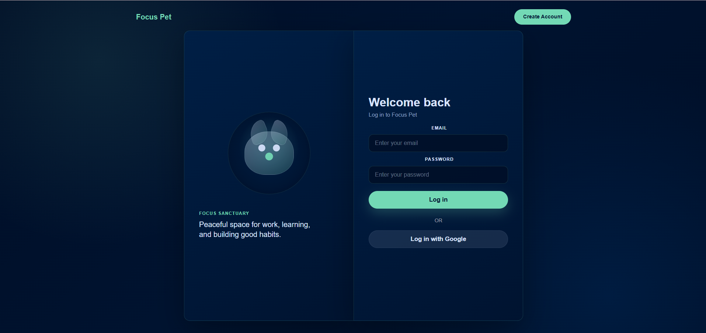

Rejestracja:

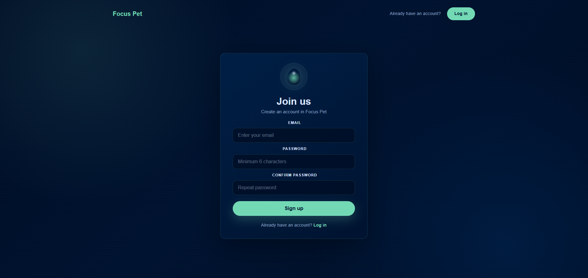

Onboarding i wybór zwierzaka:

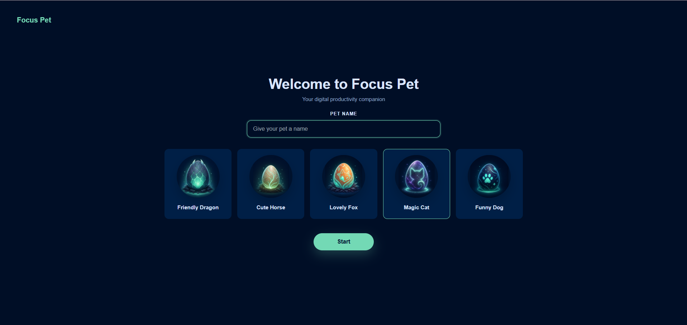

Strona główna:

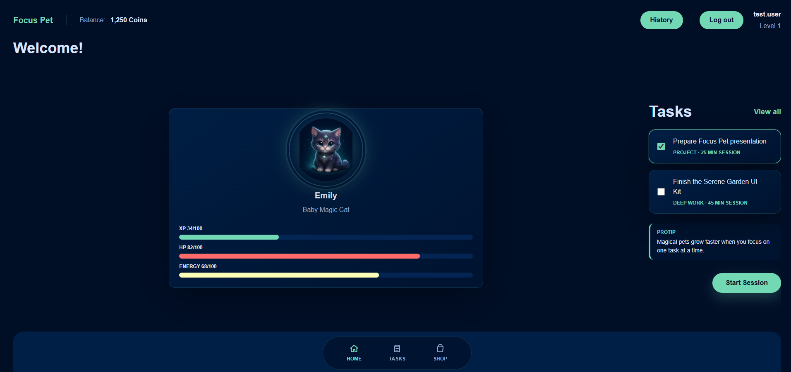

Lista zadań:

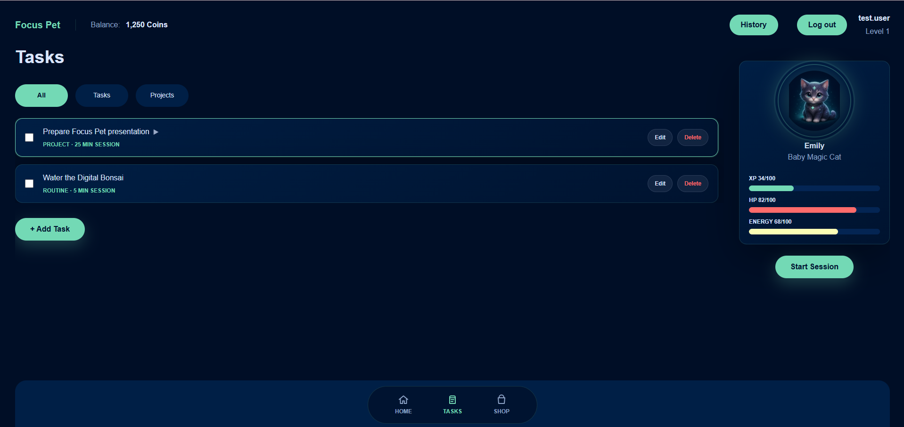

Widok projektu z podzadaniami:

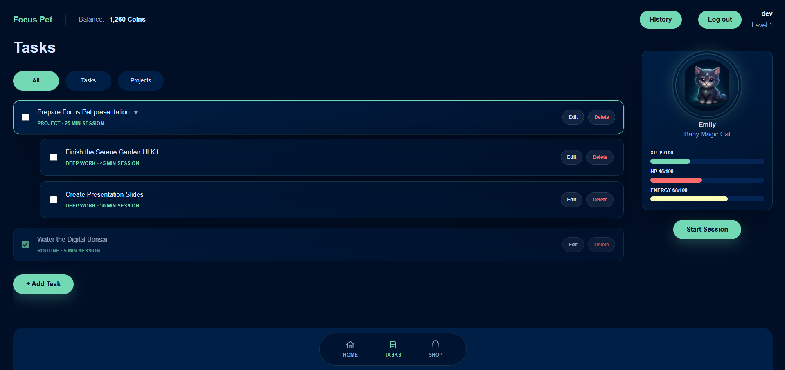

Dodawanie zadania:

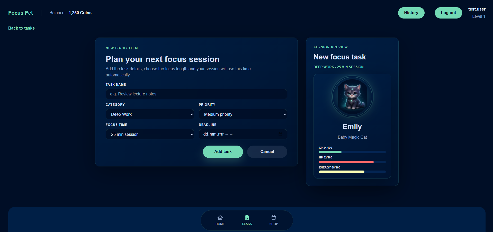

Dodawanie projektu:

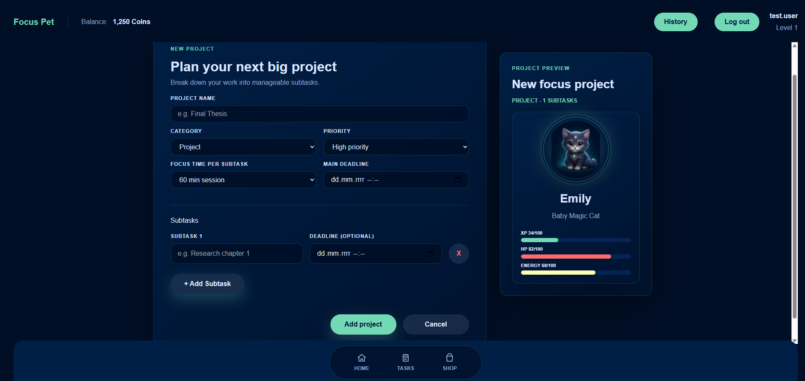

Sklep - wszystkie produkty:

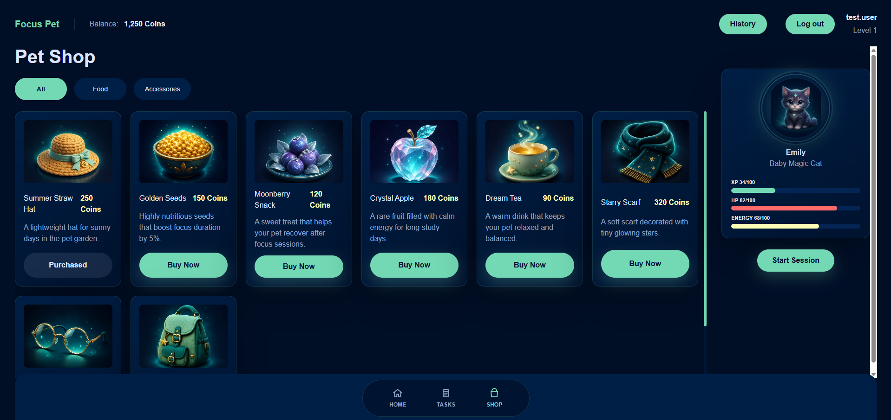

Sesja skupienia:

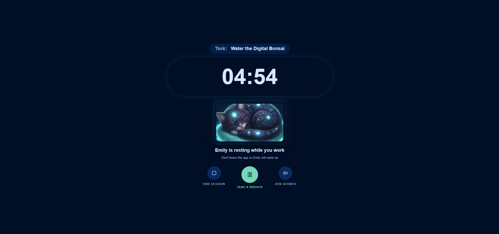

Pauza sesji:

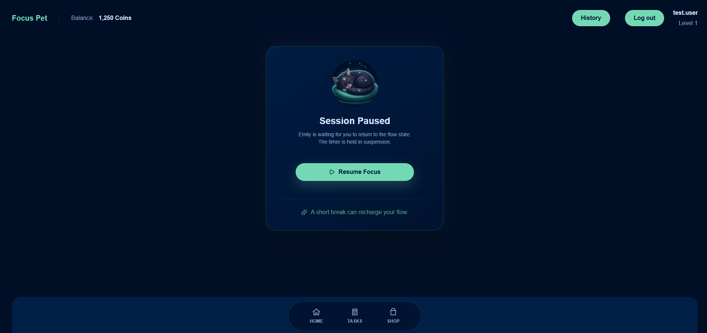

Podsumowanie zakończonej sesji:

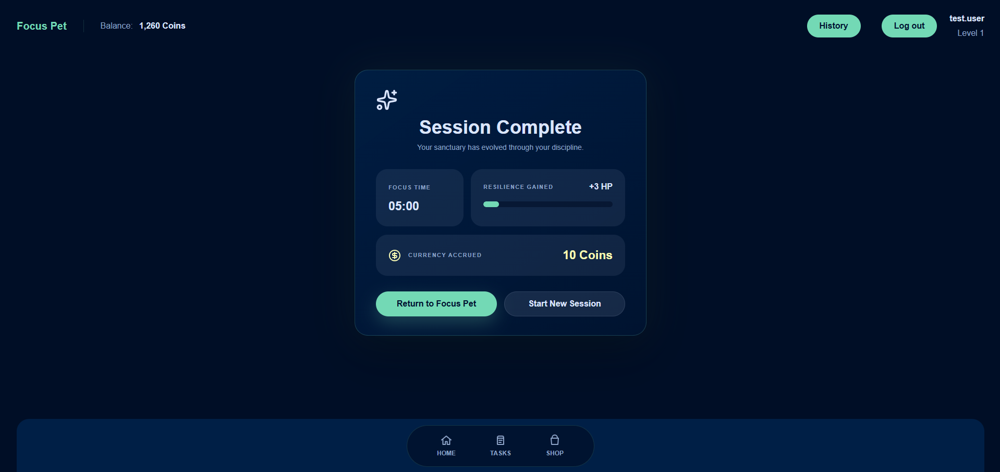

Przerwana sesja i kara HP:

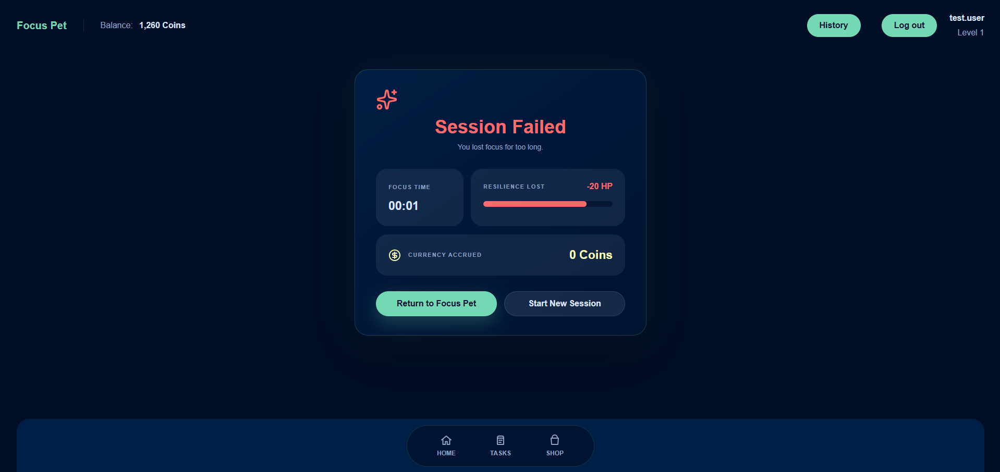

Historia aktywności:

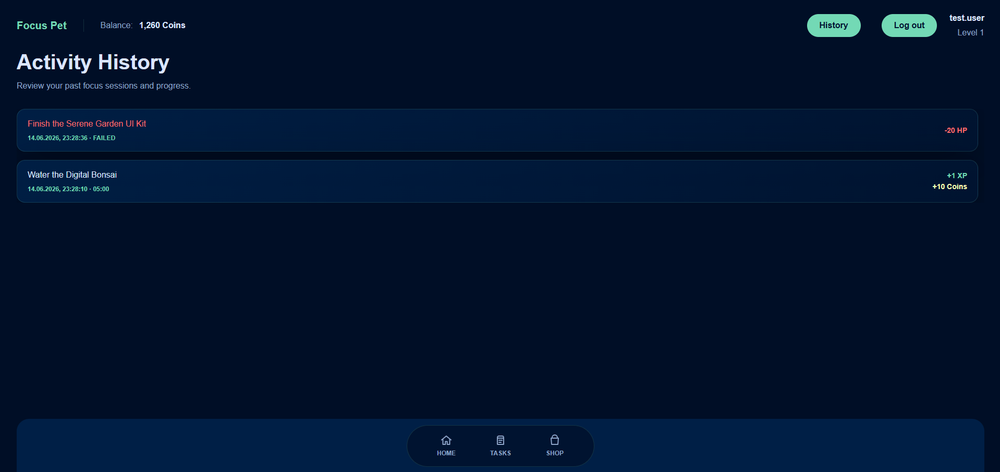

Wylogowanie:

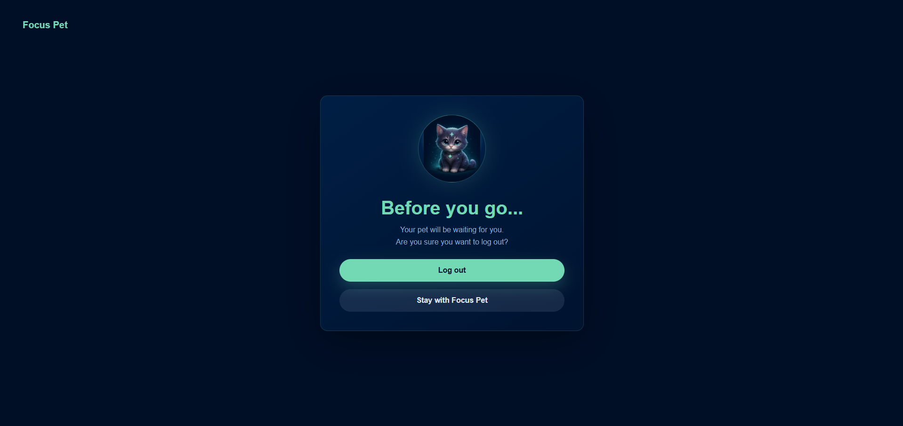

### Google Analytics

Widok Realtime z aktywnym użytkownikiem na wdrożonej aplikacji:

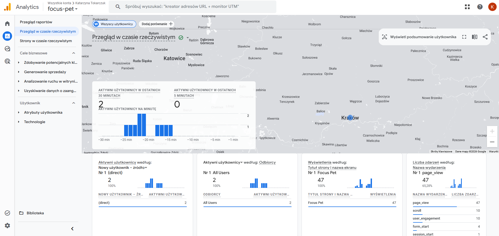

Widok Pages and screens z trasami aplikacji, np. `/home`, `/tasks`, `/shop`, `/session`:

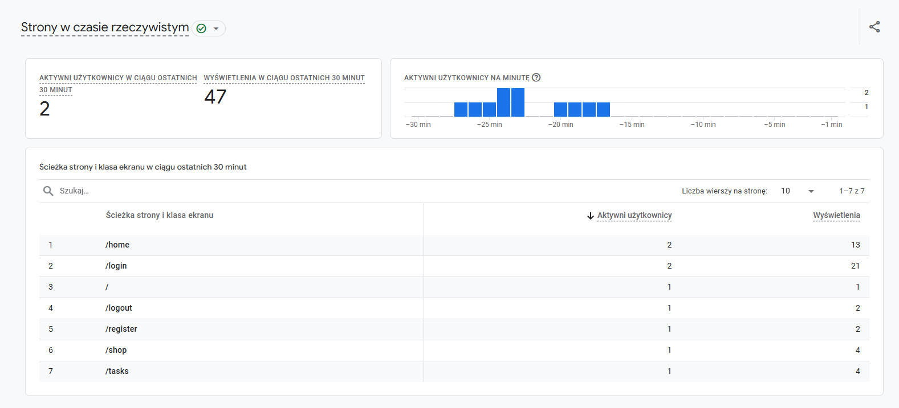

Widok Events z widocznym zdarzeniem `page_view`:

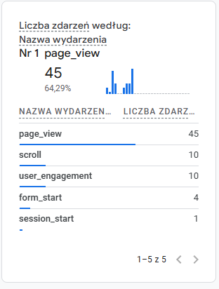


### Hotjar 

Dashboard sesji i bounce rate:

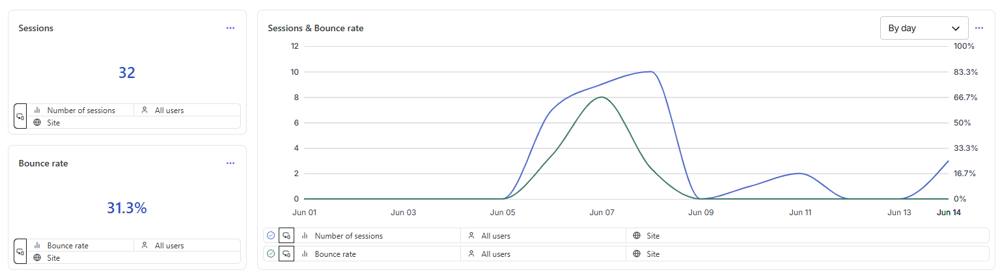

Screen pokazuje, że Hotjar zbiera ruch z aplikacji. Widoczna jest liczba sesji, bounce rate oraz wykres zmian liczby sesji i współczynnika odrzuceń w czasie.


Urządzenia i najczęściej odwiedzane ścieżki:

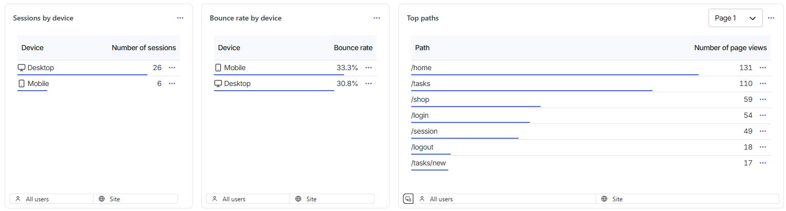

Screen pokazuje podział sesji na desktop i mobile oraz listę najczęściej odwiedzanych tras aplikacji, m.in. `/home`, `/tasks`, `/shop`, `/login` i `/session`.

Czas sesji i liczba widoków na sesję:

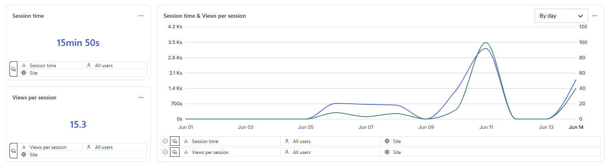

Screen pokazuje średni czas sesji oraz liczbę widoków przypadających na jedną sesję. Te dane potwierdzają, że użytkownicy realnie poruszali się po aplikacji, a nie tylko otwierali stronę startową.

Zaangażowanie według urządzenia:

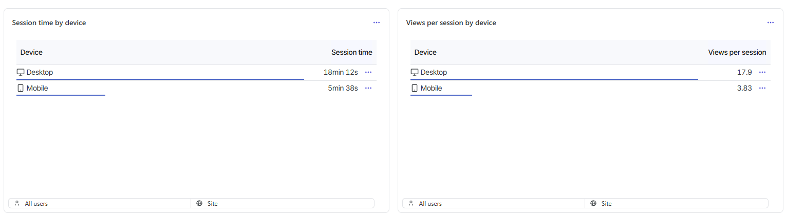

Screen pokazuje porównanie czasu sesji oraz liczby widoków na sesję dla użytkowników desktopowych i mobilnych.


## Deploy

Aplikacja została przygotowana do wdrożenia na Railway. Przy deployu należy ustawić katalog aplikacji jako:

```text
focus-pet-app
```

Po dodaniu zmiennych środowiskowych i wykonaniu deployu Railway generuje publiczny adres aplikacji, który można wykorzystać w Google Analytics oraz Hotjar/Contentsquare.
